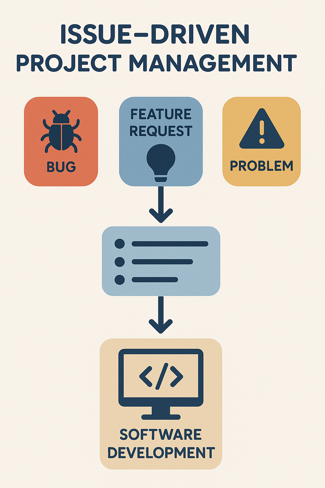

In my ICS 314, Software Engineering class, we studied software engineering mostly through the lense of web development. 
This was very interesting to me, since I had no previous web development experience.
However, there is a lot that I learned which I think is applicable more generally, and I have already begun applying some of the things I learned in my work.

## Issue Driven Project Management
I think that Issue Driven Project Management is by far the most useful thing I learned through this course.
At the very least, it is my favorite.
I have had to organize quite a few projects on my own where I was the only developer, and so it has fallen on me to keep myself organized and on track.
Previously I tried to do this with TODO notes written at the bottom of files. 
Obviously, this did not work well.
With issue driven project management, the idea is to maintain a list of tasks to accomplish, "issues", and update them as they go from 'to do' to 'in progress' and then 'complete.'
This can be further expanded by dividing issues into groups called milestones. 
This is much better because it is always clear what has been done and what still needs to be done.
For projects being developed by a group, this also allows members to always know what they could do to help when one task is completed.
I have already started using this approach for my other projects and it has been drastically easier to track my progress and remember what I need to do next.

## User Interface Frameworks
User Interface Frameworks are libraries which specialize in creating easy to use user interface elements, which can be edited quickly.
Naturally since ICS 314 focused heavily on web development, user interface frameworks were a major feature.
I had worked with other frameworks before, mostly in Python, but at the time I had just considered them a means to an end.
I learned as much as I needed to in order to make what I needed.
This class showed me that knowledge of a framework is in some ways as important as knowing the syntax of a language. 
People who knew more about React than I did could make much better front ends.
I also noticed that there were often times where lacking knowledge about the framework caused me to have custom styling not render as I intended, which meant a lot of time spent troubleshooting. 
In the future, I think I will try to narrow down on the number of frameworks I use so that I can develop more specialized skills.

## Design Patterns
Design patterns are templates for solving commonly occurring problems in software engineering.
In another essay I wrote, I recalled how I learned about the model view controller (MCV) design pattern, but only discovered the name of the concept during this class. 
Similar to learning algorithms, learning a design pattern can potentially prepare a developer to easily handle a problem rather than having to reinvent the wheel every time a particular problem occurs. 
This class showed me that it would be wise to learn some more of these design patterns so that I can be prepared in the future rather than inventing a worse solution myself.

## Wrapping Up
While almost all of the direct experience I got in ICS 314 was focused on web development, there is clearly a lot to apply to all contexts.
Taking this class greatly changed the way I intend to organize projects in the future and gave me some good ideas for what I can study in the future.

Image provided by chatGPT image generation