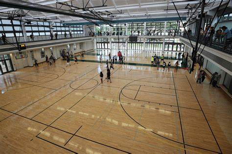

## Overview ##
At the Warrior Rec Center, there is limited space and many people who want to use the courts to play basketball or volleyball. 

This gets especially bad after 5pm, when it can be hard to get a spot on the court with so many people competing. 

Our final project is a web app that seeks to solve this problem by allowing students to reserve time on the courts for their groups, and to look for groups to join.

## Group Members ##
Maya Buchanan

Alan Reeves

Anthony Nguyen

Simon Lin

Angelo Rosal

## Mockup Page Ideas ##
Our web app would contain the following pages:

- login and sign up page

- schedule page showing times already reserved

- page to reserve times for a group

- looking for team page, where players without a group can find one

## Use Case Ideas ##
There are two basic use cases for our web app:

1) A group of students want to play basketball or volleyball at the Warrior Rec Center court at a busy time. They sign up on our web app, reserve a court as a group, and then later they show up at their reservation time and play.

2) A single student wants to play during a busy time when the court is likely to be full but doesn't know anyone to play with. They use our web app to find a group to play with at a time when they are free.

## Beyond the Basics ##
Some additional features which could be included after the basics are finished are:

- Dynamic Programming algorithm to ensure maximum court usage

- Introductory tour to the web app for new users

- Group match making service to organize games between groups

- Tournament bracket function to run basketball/volleyball tournaments