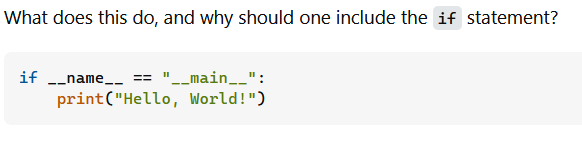

## Getting a useful answer usually depends on asking the right question correctly.

	Through my so far short programming career, I have had many questions, both simple and complex. I’ve been lost on everything from basic syntax in a language I’m unfamiliar with, to why the buffer resets when I pass the buffer object as a parameter in a function, even though everyone tells me it isn’t supposed to reset. At times like these, the best way to solve these questions is of course to ask someone. However, it is important to both ask questions intelligently and to not waste others’ time with stupid questions. In 2001, Eric Raymond and Rick Moen wrote a sort of guide on exactly this kind of thing, entitled “How to Ask Questions the Smart Way.” The points they made largely hold true today, and you can still see the difference between asking what they would outline as a smart question and asking a “not so smart” question. 

## "Not so Smart" Questions

	The best example of a “not so smart” question I can give is one I found on Stack Overflow where some new user asks “What does ‘if __name__ == main’ do?” in almost exactly that amount of words. I think this is almost the prototypical not so smart question. This user does thankfully specify in the tags that he is asking about the Python coding language, but there is otherwise almost nothing to narrow the question down. This is exactly the kind of question that could be answered with a google search, probably even back in 2009 when it was asked. Besides that, this would certainly be in the Python documentation, and on a million Python tutorial websites. It is exactly the kind of question that Raymond or Moen would answer with “STFW.” Amazingly, the user actually did get a response, which is nearly the length of a phone book, and certainly beyond the scope of what the original questioner had in mind. This is a perfect example of what happens when you ask a bad question: you get a bad answer.

## Smart Questions

	In contrast to this, I also found a much better question on Stack Overflow. While I cannot quote the entire question, since it was so verbose, the user asks for help with a null pointer exception when compiling and includes slightly fewer than 100 lines of relevant code, and also the compiler’s output to the terminal. This hits all the highlights of what a good question should be, in my opinion. All the context required is there, the user has clearly tried to answer his own question first, and he even points to the exact line which is supposed to be causing an exception. Consequently, he gets an answer back that is only about one sentence long and solves his problem succinctly. This is exactly what one should aim for when asking a question. No time is wasted by anyone, and there is enough information provided to actually help someone who wants to answer.

 ## Garbage In - Garbage Out
 
	In conclusion, asking technical questions often follows the golden rule of garbage in – garbage out. To get a useful answer, or any answer at all really, it’s important to provide context to the people or person you are asking, and to be specific in what your exact problem is. For questions like the first example, search the web. 
