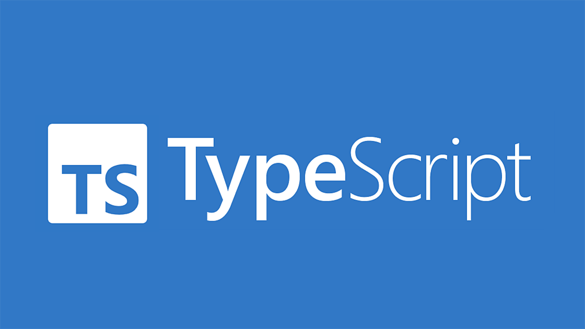

Recently for a software engineering class I have been learning TypeScript. In all honesty, I have to say that it is the first programming language I have come across that I do not immediately like. Through my so far short career in computer science, I have used quite a few languages, but my best are probably Python and C. They are also the languages which I like best. TypeScript strikes me as being closer to Python in that types are optional but it has a certain ambiguity that I am not quite comfortable with. 

## What I don't quite get

Judging only from the learning materials I have had access to, it seems like it is very common to have many unique objects, with no mechanism to make more. In fact, a TypeScript “object” seems a lot more like a Python dictionary than an object instantiated from a class file. This very notable difference is confusing to me and makes me wonder what these kinds of objects are for. As far as I can tell, objects with a class definition also seem to be part of TypeScript itself, and not the JavaScript that it is built on. 
	The most confusing thing to me about TypeScript is the ES6 syntax. While I was learning JavaScript as a primer for TypeScript, everything was extremely intuitive until I stumbled into ES6. I was immediately reminded of stories one of my instructors told me about how software engineers used to deliberately make their code impossible to read to fortify their job security. Everything from ES6 seemed like a what not to do list from a coding style guide. While I am quite skeptical of ES6 so far, I am interested to see if I begin got find uses for ES6 syntax as I get more comfortable with TypeScript. 

## In the context of engineering

Ever hear people ragging on engineering companies for delivering late and way over budget? Well, some engineering jobs are really difficult, especially if the requirements and funding are undulating underneath you. Because of the nature of the problem, sometimes engineering firms require large amounts of engineers and workers, inviting further problems and delays.

The Honolulu Rail project at home has become this sort of poster child of failure, budget overrun and overall incompetence in Hawaii. Well, working though regulatory boards and fiscal procedures in Hawaii seems like it's a mind bogglingly difficult job to do. Granted, there might be some fishy stuff going on, but I refuse to believe that everyone is involved for nefarious reasons.

The problem of creating an unprecedented public transportation backbone on an island is difficult! I'm not sure we would have done it right, even if the best people were involved.

## The bright side

While I have been mostly negative on TypeScript until this point, there is one thing that I like quite a lot about this language: optional typing. One of my favorite things about Python is the ability to require a specific type for certain purposes while leaving other things ambiguous. One of the many things this allows a software engineer to do is write functions which take specific types as parameters but which can return a value of any type. TypeScript of course shares this capability, which I find exciting. More than this, TypeScript also allows the user to specify several types using an ‘or’ operator. I am excited to see the applications of this feature.

## Final thoughts

In conclusion, I suppose I am cautiously optimistic about TypeScript. There are a few features of TypeScript that I find strange but some that seem very useful. It seems to me that the style of TypeScript, or at least the intended style, is quite different from what I am used to and I wonder what function that style serves. For now, only time will tell.

No AI was used in writing this essay
