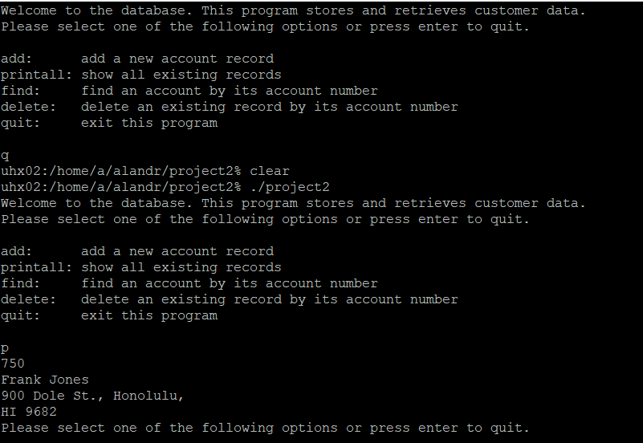

This project was a database which I created in both a C and C++ version. 

Both versions operated on a textual interface through the terminal for the front end with a linked list handling the majority of the back end.

In this project I gained a much greater understanding of both C and C++, as well as the use of pointers.

One of the functions of these programs was that it would read an existing file and continue to update it, so that the database file could theoretically be passed as a copy.

Below is a capture of what the text interface looks like.
 


The following is an exerpt from my C++ code:
```cpp
int llist::findRecord(int acctNum)
{
    int returnVal = -1;
    struct record* cursor = start;

    #ifdef DEBUGMODE
    cout << "called findRecord(int " << acctNum << ")" << endl;
    #endif

    if (start == NULL)
    {
        returnVal = -1;
    }
    else
    {
        while ((*cursor).next != NULL && acctNum != (*cursor).accountno)
        {
            #ifdef DEUGMODE
            cout << "executed loop\n";
            #endif
            
            cursor = (*cursor).next;
        }
        if (((*cursor).accountno == acctNum))
        {
            cout << (*cursor).accountno;
            cout << endl;
            cout << (*cursor).name;
            cout << (*cursor).address;
            cout << endl;

            returnVal = 0;
        }
    }
    return returnVal;
}
```
