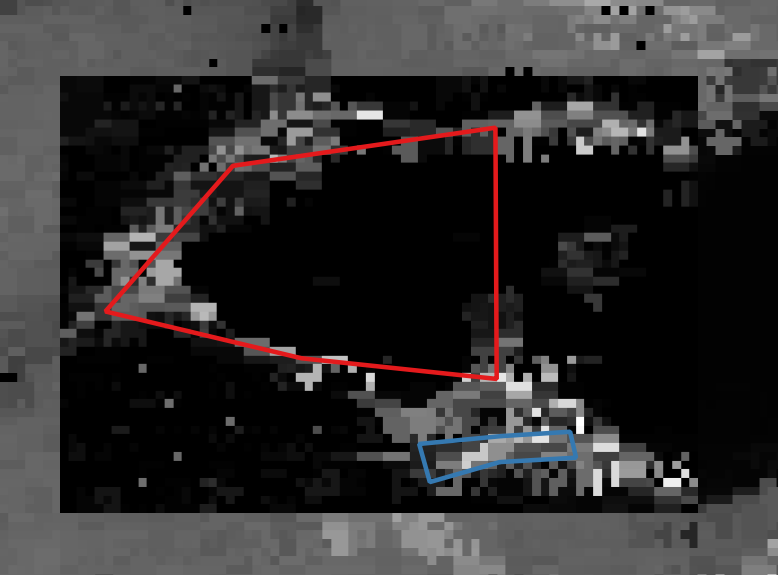
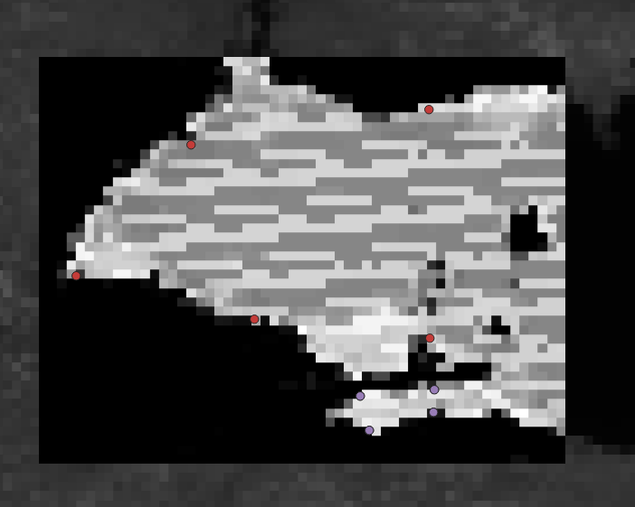

## Overview
The purpose of this project is to use MODIS data to train a machine learning algorithm which will detect algal blooms in water.
In the future, the hope is to use MODIS to detect things other than it was designed to detect.
This project builds upon my previous MODIS project, creating a working model that has been used to detect algal blooms at several locations.

### Selecting a Machine Learning Algorithm
Originally I intended to use a simple logistic regression algorithm for this purpose but testing showed that it was fairly inconsistent at this particular task.
After reading several publications on similar projects, I chose to use a random forest algorithm. 
I chose this algorithm because I thought that the voting nature of the algorithm would help control some of the confident incorrect answers that I received from the logistic regression algorithm before and because of the algorithms described in the publications I read, I felt it was the one I best understood.

### 5 parameter model

    

        
    

    

        
    
 

The current best model I have created consideres MODIS bands 1-4 as well as another 4 parameter model's prediction indicating the probability that the given pixel from which the bands were taken is an image of water.
I selected these bands because bands 1 and 2 are labeled in the MODIS manual as being useful for classifying land or water.
Bands 3 and 4 are labeled as providing information about surface properties. 
In addition, bands 1, 3, and 4 also correspond to red, blue, and green respectively, which together are useful for detecting algae.
This is because Algae absorbs red and blue light while reflecting most green light.
This model and the 4 parameter model both use imputing to handle missing data, which was a common problem with MODIS, and all values were normalized before training.

### 4 parameter model
I originally used a 4 parameter model, using bands 1-4 like the later 5 parameter model, for detecting algal blooms directly, but found that it gave some false positives well outside the water.
To correct this, I decided to use the 4 paramter model to classify land and water instead and provide that to a 5 parameter algae detection model as described above.
To do this, I simply reused my already written code and changed the training data to indicate land or water instead of algae or no algae.
This was very succesful and helped avoid false positives in later algae detection.

    

        
    

### Warp correction
One of the largest issues I faced with this project was the format of the source data.
MODIS data is published in HDF format, which is very compressed and immutable.
Once a HDF file was written to the disk, it could not be altered and re-written.
Additionally, the MYD021KM product is produced with only very loose locational metadata, leading to extreme warping of tens of kilometers.
In order to take data consistently from the same locations, I had to use the MYD03 geolocation product to edit the metadata.
Finally, I converted the resulting data to a tif file for easier manipulation, since the original file could not be overwritten.

### Data Collection
All data was taken from MODIS MYD021KM products, which contain 1km resolution spectroradiometry data.
Naturally, it would take an unreasonable amount of time to collect a meaningful amount of data manually from such a source, so I created a script to automatically take information on all indicated bands within a square defined by GPS coordinates.
For the 5 parameter model, I created a version of the script which would run all new data points through a land/water classification model and record that in the resulting training data.

## My Contribution
I was the only programmer involved in this project and so I wrote 100% of the code. 

## What I learned
This project taught me a lot about training ML models, handling large amounts of data, and using MODIS data in particular.
I learned how my choices about gathering training data can lead to overfitting and how failing to use imputing and normalization for unusable values can lead to a completely useless model.
Importantly it also gave me an opportunity to learn about expressing and visualizing data from a ML model to someone who does not understand how it works. 
I had to do this many times to demonstrate the progress I had made to the people in charge of the larger projects to which this contributes.
I learned how to automate data collection so that I can gather much more training data than I otherwise would be able to.
I also developed a good understanding of MODIS data and what it contains.
MODIS products are very poorly documented and so a lot of what I used I had to find by trial and error.

## Source Code
Source code is available on my GitHub <a href="https://github.com/AlanDReeves/AlgalBloomDetection">here.</a>