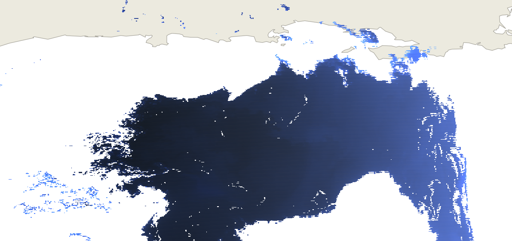
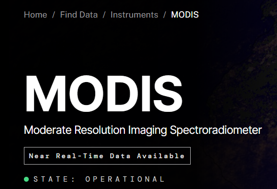

    

## Overview
The purpose of this project is to analyze NASA's MODIS spectroradiometry data, which is continuously recorded by satelite.
MODIS data is used for a wide variety of purposes, including environmental science, tracking levels of plankton in water, and many more.
For this project, I took publicly available spectrometry data from NASA's MODIS website, processed it by removing data marked as bad, and removing data which were altered by the presence of clouds. 
I then converted it to a form that is easily fed to a logistic regression model to detect the presence of certain substances. 
At the time of writing, we are still collecting training data for the model.
This project is still ongoing.

    

        
    

## About MODIS data and spectroradiometry

    

 Spectroradiometry is a process of analyzing the differing strength of light reflecting off of a surface in certain wavelength ranges, visible and invisible, to determine the nature of a substance. 

MODIS stands for Moderate Resolution Imaging Spectroradiometer. 
MODIS data is recorded by satelite across 36 wavelength bands and includes both radiance and reflectance data.
For more information, see the MODIS Website <a href="https://www.earthdata.nasa.gov/data/instruments/modis"> here </a>

## My Contribution
While I am not in charge of the overall project to which this smaller project contributes, I am the only person working on the computer science side, and the sole code contributor. 
So far, I have created visualizations of MODIS data through QGIS, and scripts to both post process data and convert it into more useful file types. 
I have created prototypes for logistic regression models using existing open source libraries and schema for training/test data.

## What I learned
I would say that this has been one of my most challenging projects.
It has been my first major data science/data visualization project and so I have discovered many the tools that are used for these purposes.
I have become somewhat familiar with QGIS, a geographic information system which allows users to visualize data on maps. 
I have also obtained a good deal of experience with MODIS data itself, which is in a very complex format for which there is a roughly 100 page user manual. 
This project has also taught me about the HDF4 and GeoTIFF file formats as well as the Python libraries that interact with them. 
In fact, most of the difficulty in this project has come from the HDF4 format used to publish MODIS data, and the obstacles to viewing, editing, and creating new HDF4 files.
This project has also given me exposure to machine learning algorithms, which I find very exciting. 
I have used scikit-learn and its associated resources for parts of this and it has been very informative.

## Source Code/Organization
I have been asked by my employer not to share source code or some of the specifics of this project. 
Please let me know if you would like more information and I will inquire about making an exception.
