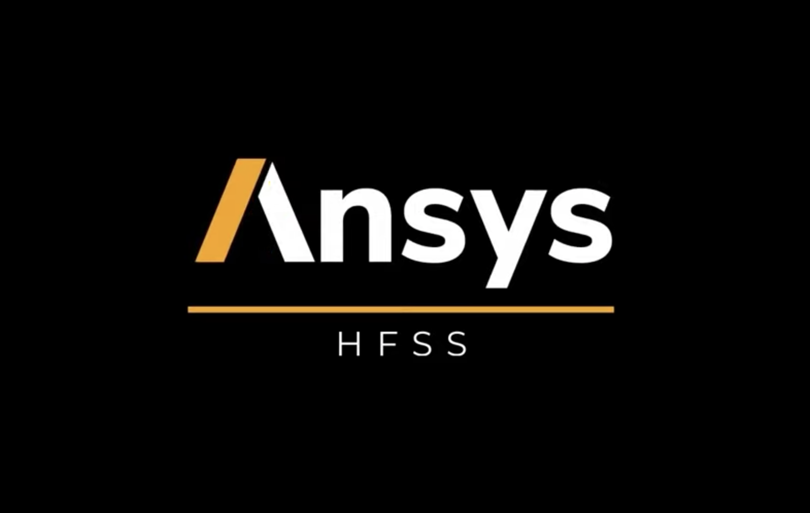
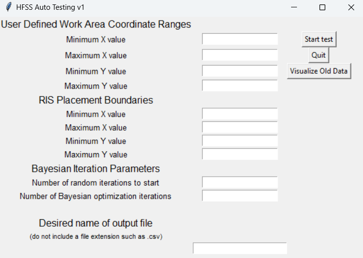

  
  

While working at my internship with the Naval Information Warfare Center (NIWC), I assisted the graphene lab by creating a program which automates testing in Ansys HFSS.

My program used a Bayesian optimization machine learning algorithm to find the best location for a device which bounces signals to create optimal signal strength in a defined area.

This program also featured a graphical user interface to allow customization of parameters for lab members not comfortable with the terminal. 

Below is a screen capture of one prototype of the GUI. 

One version of the project also allowed a visualization of previously captured data to be recreated.

