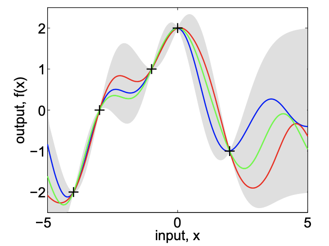

  
  

While working at my internship with the Naval Information Warfare Center (NIWC), I assisted the graphene lab by creating a program which automates testing in Ansys HFSS. My program uses a Bayesian optimization machine learning algorithm to find the best location for a device which bounces signals to create optimal signal strength in a defined area. This program also features a graphical user interface to allow customization of parameters for lab members not comfortable with the terminal. 

Below is a screen capture of one prototype of the GUI. 

One version of the project also allowed a visualization of previously captured data to be recreated.

I learned quite a lot from this project. This was actually my first project which used another program's API. Figuring out the API was sometimes quite difficult, despite the relatively good documentation. Of course, this was also my first machine learning/AI project, although implementing that was surprisingly straight forward. The package I used came from the [pypi.org](https://pypi.org/project/bayesian-optimization/) website and was easy enough to apply to the task, though I had to change my program structure to giving the optimization function a black box with too many parameters. 

I am responsible for roughly 95% of the code on this project. I did receive some advice from [Alvin Yang](https://www.linkedin.com/in/alvinyang101/), a graduate student with the electrical engineering department, which was very helpful. 
