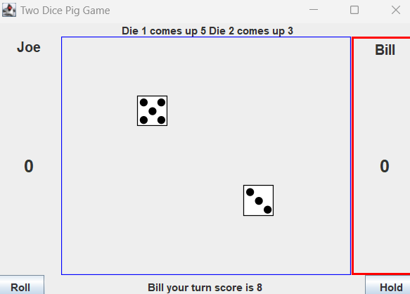

Two Dice Pig Game is a simple game which supports two players. The rules for the game are as follows:
Each turn, a player repeatedly rolls two dice until a 1 is rolled or the player decides to “hold”:

If two 1s are rolled, the player’s entire score is lost, and the turn ends.

If a single 1 is rolled, the player scores nothing and the turn ends.

If the player rolls any other number, it is added to their turn total and the player’s turn continues.

If a double is rolled, the point total is added to the turn total as with any roll but the player is obligated to roll again.

If a player chooses to “hold”, their turn total is added to their score, and it becomes the next player’s turn.

The first player to 100 or more points wins.

This was one of my earliest projects in computer science and so it is based on similar, unfinished code provided as a template by Dr. Cam Moore from UH Manoa. The version I made uses the Java Swing framework to make a graphical interface for the game and the source code consists of several class files which interact with one another. This graphical version was a cap stone to the several earlier versions I made in class, which did not all feature a graphical interface. 
