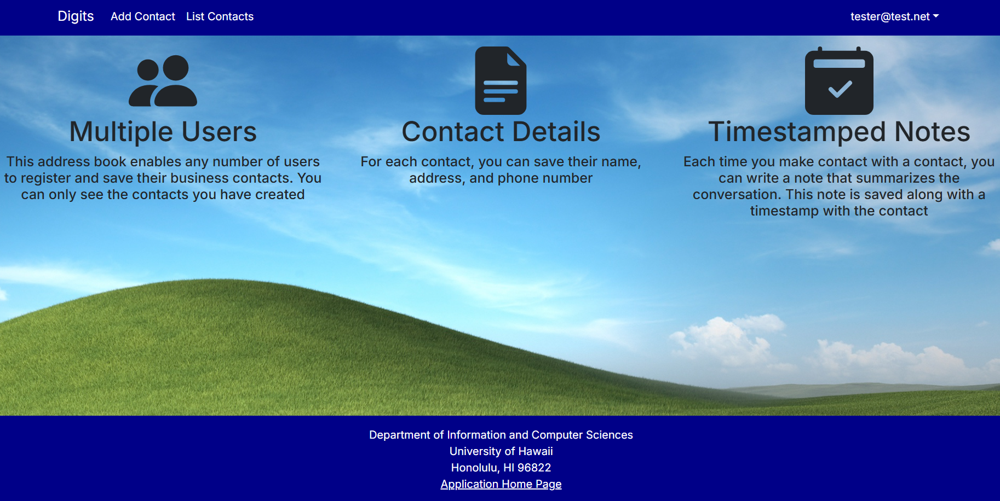
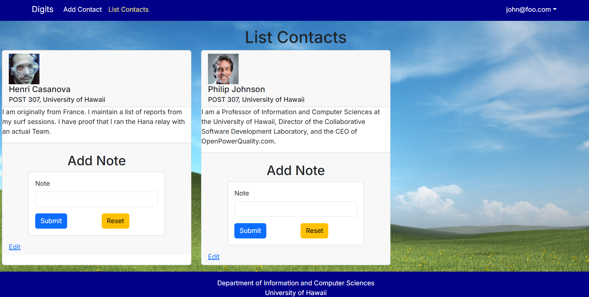
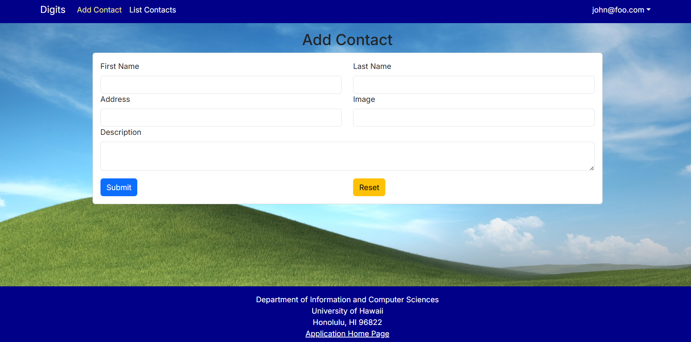

## Overview
Digits is a basic web app that I developed as part of a project in my software engineering class. 
It uses a local postgres database to store user information and contacts for each user, with any notes about a contact that the user adds. 
It shows these contacts only to the user who created them, or to the Admin account, which has different permissions. 
It uses React, Next.js, and TypeScript. 

    

        
    

    

        
    

    

        
    

## My Contribution
This was an individual project and so I developed it by myself. 
I did start with a template that was provided, but ultimately none of the pages from the template remain in the current version.

## What I learned
This was my first somewhat large web app project and so it was also my first deep dive into really applying React and Next.js.
It was also the first time I connected a database to a web app and so that was sometimes challenging. 
For this project, I installed and began using PgAdmin4 to track what was in my local database.
I definitely think I have much to learn about PgAdmin4 but this was good exposure to it.
There was also some time pressure to complete specific milestones within time limits so I learned both how long it should take to complete features and how long it actually takes me currently to do them.

## Source Code
The source code is in a public repository on my github, <a href="https://github.com/AlanDReeves/digits"> here </a>.
