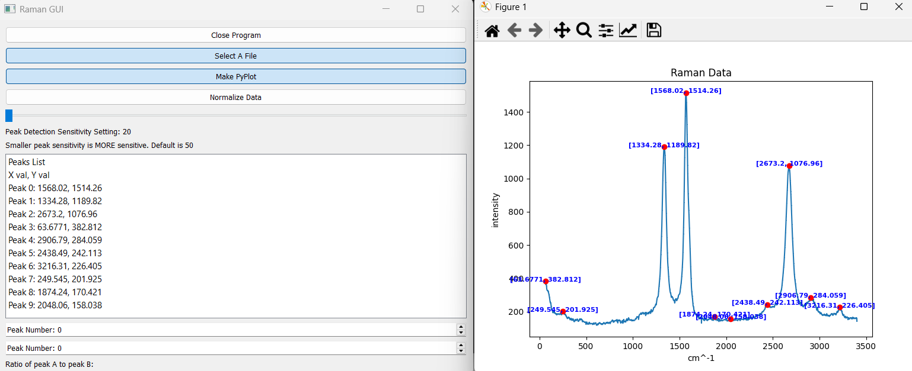

This project is a small application I made that processes raman spectroscopy data exported to a text file.
It strips data from the file and allows the user to analyze data in a few ways to help identify the substance.
I built this project using the Qt5 GUI framework, and built the GUI programatically rather than using an editor.
For this project, I also used pyInstaller to make a working exe file.
The source code is available to view <a href="https://github.com/AlanDReeves/projects/tree/main/ramanDataProcessing">here.</a>
If you would like to run the executable, at the time of writing only the copy under the "dist" folder is functional. 
 

A screen cap of the GUI at time of writing.

In this project I gained a much greater understanding of Python overall, as well as some of the more useful packages that are publicly available. This was also the first project that I actually put on github, so I learned how to use github while developing this.
One of my goals in this project was to get a better understanding of the Qt5 framework so that I could use it more in future projects, and I believe I accomplished that as well.

There were no teams for this project, so all of the work was done by me.
